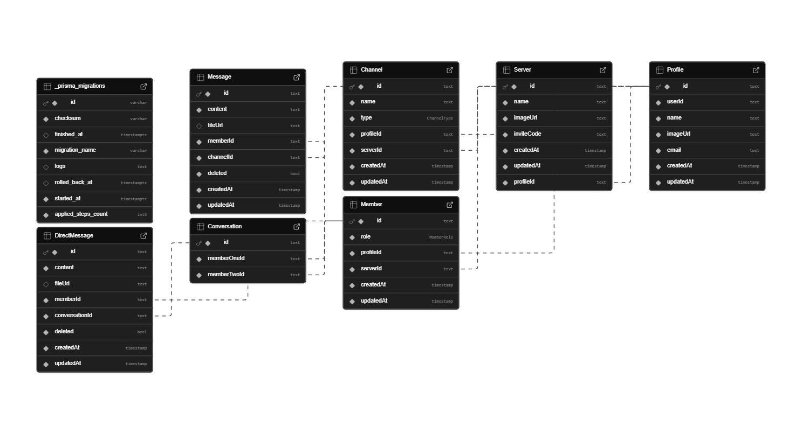

# NT106.P21.ANTT - LẬP TRÌNH MẠNG CĂN BẢN
***Lời ngỏ:***
***Chào mừng quý thầy cô và các bạn đến với ứng dụng Bubbly Chatcủa nhóm 3! Đây là sản phẩm mà cả nhóm đã cùng nhau lên ý tưởng, xây dựng và hoàn thiện với tất cả sự tâm huyết. Chúng mình hy vọng rằng ứng dụng này sẽ mang lại những trải nghiệm hữu ích và thú vị cho mọi người. Dù đã cố gắng hết sức, nhưng chắc chắn không thể tránh khỏi những thiếu sót. Nhóm rất mong nhận được những góp ý chân thành từ quý thầy cô và các bạn để có thể cải thiện và phát triển sản phẩm ngày càng tốt hơn. Sự ủng hộ và đóng góp của mọi người chính là động lực lớn nhất để nhóm tiếp tục học hỏi và hoàn thiện hơn trong những dự án tiếp theo. Nhóm 3 xin chân thành cảm ơn! ❤️***

# I. ĐỒ ÁN MÔN HỌC
**Tên đồ án: Bubbly Chat** Đây là một úng dụng chat thông thường được nhóm mình làm lại với các chức năng đơn giản.

# II. HƯỚNG DẪN CÀI ĐẶT 
## Set up
### Mở Terminal hoặc Powershell copy đoạn mã và paste 

```
git clone https://github.com/limelight-hub/discord-desktop.git
```
# III. SƠ ĐỒ PHÂN RÃ


# IV. CƠ SỞ LÝ THUYÊTSS
## Công nghệ sử dụng

-
-
-
-


## Api sử dụng

-
-
-
-


# V. CÁC TÍNH NĂNG
## Các tình năng nhó đã hoàn thiện:
- Tạo channel nhắn tin
- Private messages
- upload file và pdf
## Các tính năng chưa và sẽ hoàn thiện sắp tới:
- Phone Call and Video Call


# VI.sINH VIÊN THỰC HIỆN
Trần Đồng Trúc Lam − 22520746  
Nguyễn Anh Tuấn − 23521717   
Ngô Thái Vinh − 23521791
## Folder Structure

```
.
├── next-env.d.ts
├── next.config.js    //nextjs config file https://nextjs.org/docs/api-reference/next.config.js/introduction
├── package.json
├── postcss.config.js
├── README.md
├── src               //frontend src:
│   ├── assets
│   ├── components    //from shadcn/ui
│   │   └── ui        //from shadcn/ui
│   ├── lib
│   ├── pages         //next.js pages folder
│   ├── styles
│   └── types
├── src-tauri         //backend src:
│   ├── build.rs
│   ├── Cargo.lock
│   ├── Cargo.toml    // https://doc.rust-lang.org/cargo/reference/manifest.html
│   ├── icons         // https://tauri.app/v1/guides/features/icons/
│   ├── src           //rust codes
│   └── tauri.conf.json    //tauri config file https://tauri.app/v1/api/config/
├── tailwind.config.js     //tailwind config file
├── tsconfig.json          //typescript config file
└── yarn.lock
```

## Recommended IDE Setup

- 
